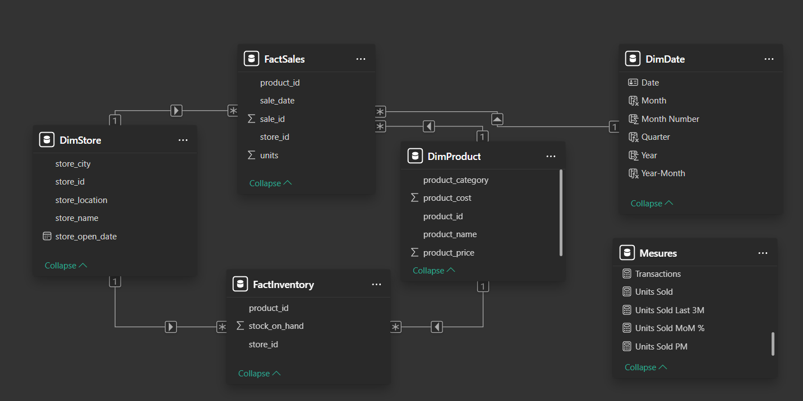
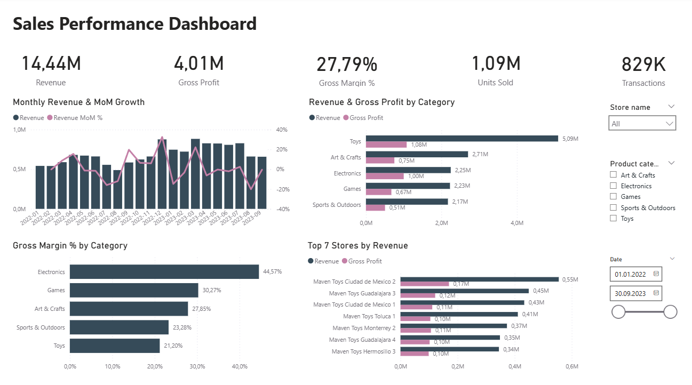
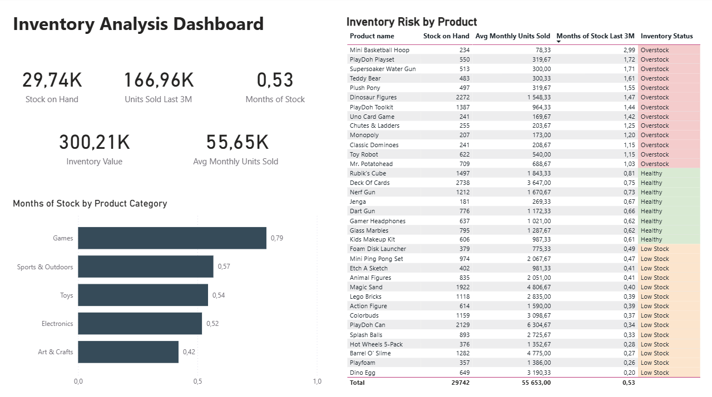

# Retail Sales & Inventory Performance Analysis

## Project Overview

This project presents an end-to-end retail analytics solution for Maven Toys, a toy store chain operating across Mexico.

Using PostgreSQL and Power BI, the project combines historical sales data with a current inventory snapshot to evaluate sales performance, profitability, and inventory efficiency across stores and product categories.

The final Power BI report provides management with two connected analytical views: Sales Performance and Inventory Analysis. Together, they enable users to monitor commercial performance, analyze recent sales velocity, estimate inventory coverage, and identify products that may require inventory action.

## 1. Business Problem

Maven Toys operates a multi-store retail network where sales performance and product demand vary across stores and product categories. Management needs a consolidated analytical view that connects commercial performance with current inventory levels.

The key challenge is not only to understand how much the business sells and earns, but also whether current inventory is aligned with recent demand. Excess inventory ties up capital in slow-moving products, while insufficient inventory increases the risk of product unavailability.

The objective is therefore to build a reporting solution that helps management monitor sales and profitability, evaluate inventory efficiency, and identify products requiring attention based on recent sales velocity and current stock levels.

## 2. Analytical Objectives

The analysis is organized around three main objectives:

1. **Sales & Profitability Performance**  
   Evaluate revenue, gross profit, gross margin, units sold, transaction activity, and monthly sales trends across the retail network.

2. **Inventory Efficiency**  
   Measure current stock levels and inventory value and compare them with recent product sales velocity to estimate how long existing inventory is expected to last.

3. **Inventory Risk Management**  
   Identify products with potentially insufficient or excessive inventory using inventory coverage metrics and a transparent Low Stock / Healthy / Overstock classification.

## 3. Data Description

### 3.1 Data Source

The analysis uses the **Mexico Toy Sales** dataset published by Maven Analytics.

Original dataset: Maven Analytics Data Playground — Mexico Toy Sales.

The dataset contains sales and inventory data for **Maven Toys**, a fictitious toy store chain operating across Mexico. It includes sales transactions, product information, store attributes, and a current inventory snapshot.

The sales data covers the period from **January 2022 through September 2023**.

The dataset consists of five analytical tables:

* `sales.csv` — sales transactions by store and product;
* `products.csv` — product information, categories, costs, and retail prices;
* `stores.csv` — store information and location characteristics;
* `inventory.csv` — current product inventory by store;
* `calendar.csv` — calendar dates covering the sales observation period.

An additional `data_dictionary.csv` file provides definitions for the source fields.

**License:** Public Domain

### 3.2 Unit of Observation and Granularity

The dataset contains multiple tables with different units of observation. Understanding their granularity is important before joining the tables and calculating sales, profitability, or inventory metrics.

| Dataset     | Unit of observation              | Granularity                                                  |
| ----------- | -------------------------------- | ------------------------------------------------------------ |
| `sales`     | Sales transaction record         | One individual sales record, identified by `Sale_ID`         |
| `products`  | Product                          | One row per product                                          |
| `stores`    | Store                            | One row per store                                            |
| `inventory` | Store-product inventory position | One row per recorded Store × Product combination             |
| `calendar`  | Calendar date                    | One row per date                                             |

Therefore:

* `Sale_ID` uniquely identifies individual records in the `sales` table;
* each row in `sales` represents an individual sales record rather than an aggregated daily sale;
* multiple sales records may exist for the same **Store × Product × Date** combination;
* `Product_ID` links sales and inventory records to product attributes;
* `Store_ID` links sales and inventory records to store attributes;
* inventory is recorded at the **Store × Product** level rather than at the sales transaction level;
* the `inventory` table contains current stock information rather than historical daily inventory levels;
* joining inventory directly to transaction-level sales can duplicate `Stock_On_Hand` values and lead to incorrect inventory totals;
* transaction-level sales must therefore be aggregated to the appropriate analytical level before being compared with current inventory.

### 3.3 Data Dictionary

The source dataset contains 19 fields across five analytical tables.

| Table       | Column             | Description                                   | Analytical role                                    |
| ----------- | ------------------ | --------------------------------------------- | -------------------------------------------------- |
| `sales`     | `Sale_ID`          | Unique sales record identifier                | Record-level validation and duplicate checks       |
| `sales`     | `Date`             | Date of the sales record                      | Time-series and monthly trend analysis       |
| `sales`     | `Store_ID`         | Store identifier                              | Store-level aggregation and table relationships    |
| `sales`     | `Product_ID`       | Product identifier                            | Product-level aggregation and table relationships  |
| `sales`     | `Units`            | Number of units sold                          | Sales volume and demand calculation                |
| `products`  | `Product_ID`       | Product identifier                            | Product key and table relationships                |
| `products`  | `Product_Name`     | Product name                                  | Product-level reporting and interpretation         |
| `products`  | `Product_Category` | Product category                              | Category-level performance analysis                |
| `products`  | `Product_Cost`     | Unit cost of the product                      | COGS and gross profit calculation                  |
| `products`  | `Product_Price`    | Retail price per unit                         | Revenue and gross margin calculation               |
| `stores`    | `Store_ID`         | Store identifier                              | Store key and table relationships                  |
| `stores`    | `Store_Name`       | Store name                                    | Store-level reporting                              |
| `stores`    | `Store_City`       | City where the store is located               | Store identification and reporting context         |
| `stores`    | `Store_Location`   | Type of store location                        | Store location attribute and reporting context     |
| `stores`    | `Store_Open_Date`  | Date when the store opened                    | Store information and data validation              |
| `inventory` | `Store_ID`         | Store identifier                              | Store-level inventory relationship                 |
| `inventory` | `Product_ID`       | Product identifier                            | Product-level inventory relationship               |
| `inventory` | `Stock_On_Hand`    | Current number of product units held in stock | Inventory level, coverage, and stock-risk analysis |
| `calendar`  | `Date`             | Calendar date                                 | Calendar coverage validation                       |

## 4. Data Quality Assessment

Before performing the analysis, the source tables were systematically validated to confirm their structure, completeness, and suitability for further analysis.

The assessment focuses on row counts, key uniqueness and granularity, missing values, referential integrity, value ranges, business rules, and inventory coverage. Particular attention is given to differences in granularity between transactional sales data and point-in-time inventory data, as these tables cannot be combined directly without appropriate aggregation.

### 4.1 Row Counts, Key Uniqueness and Granularity

The first validation step confirmed the number of records in each source table and tested whether the expected primary or composite keys uniquely identify individual records.

| Table | Rows | Expected key | Unique keys | Result |
|---|---:|---|---:|---|
| `sales` | 829,262 | `Sale_ID` | 829,262 | Unique |
| `products` | 35 | `Product_ID` | 35 | Unique |
| `stores` | 50 | `Store_ID` | 50 | Unique |
| `inventory` | 1,593 | `Store_ID × Product_ID` | 1,593 | Unique |
| `calendar` | 638 | `Date` | 638 | Unique |

All expected keys were confirmed to be unique.

Additional validation of the `sales` table showed that multiple individual sales records can occur for the same **Store × Product × Date** combination. Therefore, `Sale_ID` represents the transaction-level key, while **Store × Product × Date** is an analytical aggregation level rather than the raw data granularity.

This distinction is important because transaction-level sales must be aggregated before being compared with inventory recorded at the **Store × Product** level.

### 4.2 Missing Values

All source tables were checked for missing values.

For numeric and identifier fields, the validation included SQL `NULL` values. For text-based fields imported as `VARCHAR`, the checks also included empty strings.

No missing values were identified in any of the five analytical tables:

- `sales`
- `products`
- `stores`
- `inventory`
- `calendar`

As a result, no records required removal or imputation due to missing data.

### 4.3 Referential Integrity

Referential integrity was validated across the `sales`, `inventory`, `products`, and `stores` tables.

The following relationships were checked:

- `sales.Store_ID` → `stores.Store_ID`
- `sales.Product_ID` → `products.Product_ID`
- `inventory.Store_ID` → `stores.Store_ID`
- `inventory.Product_ID` → `products.Product_ID`

No unmatched foreign keys were identified in any of the tested relationships.

Therefore, all sales and inventory records can be successfully linked to their corresponding store and product dimensions.

### 4.4 Value, Range and Business Rule Validation

Key numeric fields, date ranges, and business rules were validated to identify implausible values and inconsistencies before further analysis.

#### Dates

Sales cover the period from **January 1, 2022 to September 30, 2023**, representing 638 distinct sales dates. The `calendar` table covers the same 638-day period, and all sales dates are represented in the calendar.

Store opening dates range from **September 18, 1992 to May 18, 2016**. No sales were recorded before the corresponding store opening date.

The source files use different date formats: sales and store opening dates are stored as `YYYY-MM-DD`, while calendar dates use `M/D/YYYY`. Date fields used in the analytical layer were therefore converted to appropriate date types during data preparation.

#### Sales Quantities

Sales quantities range from **1 to 30 units per sales record**.

No zero or negative quantities were identified, so all sales records contain valid positive sales volumes.

#### Inventory Levels

`Stock_On_Hand` ranges from **0 to 139 units** per Store × Product combination.

No negative inventory values were identified. **77 inventory records have zero stock**, which represents a valid inventory state and will be retained for further inventory analysis.

#### Product Cost and Price

Product costs range from **$1.99 to $34.99**, while retail prices range from **$2.99 to $39.99**.

No non-positive cost or price values were identified, and no products were priced at or below their unit cost.

Overall, the tested values and business rules did not identify records requiring exclusion or correction before analysis.


### 4.5 Inventory Coverage and Data Limitations

The `inventory` table represents a point-in-time stock snapshot at the **Store × Product** level. Its coverage was therefore assessed separately before combining inventory information with historical sales.

With 50 stores and 35 products, there are **1,750 theoretically possible Store × Product combinations**. The inventory table contains records for **1,593 combinations**, leaving **157 combinations without an inventory record**.

Historical sales were then used to investigate these missing combinations:

| Inventory coverage | Store × Product combinations |
|---|---:|
| Possible combinations | 1,750 |
| Present in inventory | 1,593 |
| Missing from inventory | 157 |
| Missing but with historical sales | 41 |
| Missing and without historical sales | 116 |

Of the 157 combinations missing from the inventory snapshot, **41 have historical sales records**, while **116 have no historical sales during the observed period**.

The absence of an inventory record therefore cannot be interpreted reliably as zero stock. For combinations with historical sales, the missing record may reflect a change in assortment or another limitation of the current inventory snapshot. For combinations without historical sales, the product may not have been part of the store's assortment. The dataset does not provide enough information to distinguish these cases conclusively.

For this reason, missing Store × Product combinations are **not converted to `Stock_On_Hand = 0`**. 
Only the 77 records explicitly reported with `Stock_On_Hand = 0` are treated as confirmed zero-stock positions.

This distinction is preserved throughout the inventory analysis to avoid overstating stockouts or inventory shortages.

Because the inventory data represents only a current snapshot, it cannot be used to reconstruct historical stock levels or determine whether past sales were lost due to stockouts. Historical inventory snapshots would be required to quantify lost sales or analyze stockout duration over time.

## 5. Data Preparation

Following the data quality assessment, a separate analytical layer was created in PostgreSQL to prepare the source data for Power BI.

The original imported tables were preserved unchanged, while standardized analytical views were created in a dedicated `analytics` schema. This approach separates the raw source data from the transformations required for reporting and analysis.

### 5.1 Data Type Standardization

Several fields were imported from the CSV source files as text and required conversion to appropriate analytical data types.

The following transformations were applied:

| Source field | Source type | Analytical type | Transformation |
|---|---|---|---|
| `sales.Date` | VARCHAR | DATE | Converted to PostgreSQL `DATE` |
| `stores.Store_Open_Date` | VARCHAR | DATE | Converted to PostgreSQL `DATE` |
| `products.Product_Cost` | VARCHAR | NUMERIC(10,2) | `$` removed and value converted to numeric |
| `products.Product_Price` | VARCHAR | NUMERIC(10,2) | `$` removed and value converted to numeric |

### 5.2 Analytical Views

Four analytical views were created in the `analytics` schema:

| View | Purpose |
|---|---|
| `analytics.fact_sales` | Transaction-level sales fact table |
| `analytics.fact_inventory` | Current inventory snapshot at Store × Product level |
| `analytics.dim_products` | Product attributes with standardized cost and price fields |
| `analytics.dim_stores` | Store attributes with standardized opening dates |

The source `calendar` table was used during data validation to confirm complete date coverage but was not included in the analytical SQL layer. A dedicated date dimension was instead created in Power BI to support date hierarchies and DAX time-intelligence calculations.

No derived business metrics were added to the SQL layer. Revenue, cost, profit, margin, inventory coverage, and time-based KPIs were defined in the Power BI semantic model, keeping the SQL layer focused on data preparation and structural consistency.


## 6. Data Model

The Power BI semantic model was designed using a star-schema approach with shared product and store dimensions connected to separate sales and inventory fact tables.



The model contains three dimensions, two fact tables, and a dedicated measures table:

| Table | Type | Purpose |
|---|---|---|
| `DimProduct` | Dimension | Product names, categories, unit costs, and retail prices |
| `DimStore` | Dimension | Store names, cities, location types, and opening dates |
| `DimDate` | Dimension | Calendar attributes used for time-based sales analysis |
| `FactSales` | Fact | Transaction-level historical sales |
| `FactInventory` | Fact | Current inventory snapshot by Store × Product |
| `Measures` | Measures table | Centralized DAX measures used throughout the report |

### 6.1 Relationships

The model uses one-to-many relationships with single-direction filtering from dimensions to fact tables:

- `DimProduct[product_id]` → `FactSales[product_id]`
- `DimProduct[product_id]` → `FactInventory[product_id]`
- `DimStore[store_id]` → `FactSales[store_id]`
- `DimStore[store_id]` → `FactInventory[store_id]`
- `DimDate[Date]` → `FactSales[sale_date]`

This structure allows product and store filters to be applied consistently to both sales and inventory while keeping the two fact tables at their appropriate granularity.

### 6.2 Date Dimension and Inventory Snapshot

A dedicated `DimDate` table was created in Power BI to support monthly reporting and DAX time-intelligence calculations. It includes calendar attributes such as year, quarter, month, month number, and year-month.

`DimDate` is intentionally related only to `FactSales`. The `FactInventory` table represents a current point-in-time inventory snapshot and does not contain a historical inventory date.

Creating a relationship between `DimDate` and `FactInventory` would therefore incorrectly imply that historical inventory levels are available. Inventory metrics are instead evaluated against recent sales activity while the current stock snapshot remains independent of the report's sales date context.

## 7. Key Metrics & DAX

Business metrics were defined in the Power BI semantic model using DAX. The measures are organized around two analytical areas: sales performance and inventory efficiency.

### 7.1 Sales Performance Metrics

The main sales KPIs used in the report are:

| Metric | Purpose |
|---|---|
| `Revenue` | Total sales revenue based on units sold and product price |
| `COGS` | Cost of goods sold based on units sold and product cost |
| `Gross Profit` | Revenue remaining after product cost |
| `Gross Margin %` | Gross profit as a percentage of revenue |
| `Units Sold` | Total number of product units sold |
| `Transactions` | Number of sales records |
| `Revenue MoM %` | Month-over-month change in revenue |
| `Units Sold MoM %` | Month-over-month change in units sold |

Revenue is calculated dynamically from transaction-level sales and the corresponding product price:

```DAX
Revenue =
SUMX(
    FactSales,
    FactSales[units] * RELATED(DimProduct[product_price])
)
```

Gross profit and gross margin are then derived from revenue and cost of goods sold:

```DAX
Gross Profit =
[Revenue] - [COGS]
```

```DAX
Gross Margin % =
DIVIDE(
    [Gross Profit],
    [Revenue]
)
```

These measures provide the core commercial performance indicators used across the Sales Performance dashboard.

### 7.2 Inventory Metrics

Inventory analysis combines the current inventory snapshot with recent historical sales activity.

The main inventory metrics are:

| Metric | Purpose |
|---|---|
| `Stock on Hand` | Current number of units held in inventory |
| `Inventory Value` | Current inventory valued at product cost |
| `Units Sold Last 3M` | Units sold during the recent three-month demand window |
| `Avg Monthly Units Sold Last 3M` | Average monthly sales velocity over the same period |
| `Months of Stock Last 3M` | Estimated number of months current inventory can support recent demand |
| `Inventory Status` | Product-level inventory risk classification |

Inventory value is calculated using product cost rather than retail price because the objective is to estimate the amount of capital tied up in current inventory:

```DAX
Inventory Value =
SUMX(
    FactInventory,
    FactInventory[stock_on_hand] * RELATED(DimProduct[product_cost])
)
```

### 7.3 Recent Demand and Inventory Coverage

Because the inventory table contains only a current snapshot, inventory levels are evaluated against recent historical sales velocity rather than against the full sales history.

A three-month demand window was selected as a practical analytical assumption. It provides a more recent representation of product demand while reducing the influence of short-term monthly fluctuations.

The demand window is anchored to the latest sales date available in the dataset:

```DAX
Units Sold Last 3M =
VAR MaxSalesDate =
    CALCULATE(
        MAX(FactSales[sale_date]),
        REMOVEFILTERS(DimDate)
    )
VAR StartDate =
    EOMONTH(MaxSalesDate, -3) + 1
RETURN
    CALCULATE(
        [Units Sold],
        REMOVEFILTERS(DimDate),
        DATESBETWEEN(
            DimDate[Date],
            StartDate,
            MaxSalesDate
        )
    )
```

The use of `REMOVEFILTERS(DimDate)` is intentional. It keeps the inventory demand benchmark anchored to the latest sales date in the dataset rather than allowing the Sales Performance date slicer to redefine the inventory coverage period.

In the current dataset, the latest sales date is **September 30, 2023**, so the resulting demand window covers **July 1 through September 30, 2023**.

Average monthly sales velocity is calculated from this three-month period:

```DAX
Avg Monthly Units Sold Last 3M =
DIVIDE(
    [Units Sold Last 3M],
    3
)
```

Inventory coverage is then estimated by comparing current stock with average monthly demand:

```DAX
Months of Stock Last 3M =
DIVIDE(
    [Stock on Hand],
    [Avg Monthly Units Sold Last 3M]
)
```

For example, a Months of Stock value of `0.5` indicates that current inventory represents approximately half a month of recent average sales volume.

### 7.4 Inventory Risk Classification

To make inventory coverage easier to interpret operationally, products are assigned to four inventory status categories:

| Months of Stock | Status | Interpretation |
|---:|---|---|
| No recent sales | `No Sales` | Inventory coverage cannot be evaluated using recent sales velocity |
| < 0.5 months | `Low Stock` | Current inventory is low relative to recent demand |
| 0.5–1.0 months | `Healthy` | Current inventory is within the selected coverage range |
| > 1.0 month | `Overstock` | Current inventory is high relative to recent demand |

The classification is implemented as:

```DAX
Inventory Status =
VAR MonthsStock =
    [Months of Stock Last 3M]
RETURN
    IF(
        NOT ISINSCOPE(DimProduct[product_name]),
        BLANK(),
        SWITCH(
            TRUE(),
            ISBLANK(MonthsStock), "No Sales",
            MonthsStock < 0.5, "Low Stock",
            MonthsStock <= 1, "Healthy",
            "Overstock"
        )
    )
```

`ISINSCOPE` limits the classification to individual products and prevents an inventory status from being assigned to aggregate totals where a single status would not be meaningful.

The thresholds used in this project are analytical assumptions rather than universal retail standards. In a production environment, inventory targets should be calibrated using factors such as supplier lead times, replenishment frequency, demand variability, safety stock requirements, and target service levels.


## 8. Power BI Dashboard

The final Power BI report consists of two connected pages: **Sales Performance** and **Inventory Analysis**.

The report is designed to move from overall commercial performance to inventory-level decision support. Store and product category slicers are synchronized across both pages, allowing users to maintain the same analytical context when moving between sales and inventory views.

### 8.1 Sales Performance Dashboard



The Sales Performance page provides an executive overview of commercial performance across the retail network.

The main KPIs include:

- **Revenue** — total sales revenue;
- **Gross Profit** — revenue after product cost;
- **Gross Margin %** — gross profit relative to revenue;
- **Units Sold** — total product units sold;
- **Transactions** — total number of sales records.

The dashboard also provides several analytical views:

- **Monthly Revenue & MoM Growth** tracks revenue performance over time and highlights month-over-month changes.
- **Revenue & Gross Profit by Category** compares the commercial contribution of product categories.
- **Gross Margin % by Category** highlights differences in profitability across categories.
- **Top 7 Stores by Revenue** identifies the highest-performing stores.

Users can filter the analysis by **store**, **product category**, and **date range**.

Store and product category selections are synchronized with the Inventory Analysis page, allowing users to move from sales performance to inventory analysis without losing the selected business context.

### 8.2 Inventory Analysis Dashboard



The Inventory Analysis page evaluates current inventory in relation to recent product demand.

The main KPIs include:

- **Stock on Hand** — current physical inventory;
- **Inventory Value** — inventory valued at product cost;
- **Units Sold Last 3M** — recent sales volume used as the demand benchmark;
- **Avg Monthly Units Sold** — average monthly sales velocity over the recent three-month period;
- **Months of Stock** — estimated inventory coverage based on recent demand.

The **Months of Stock by Product Category** visual compares inventory coverage across product categories and helps identify categories with relatively high or low stock levels.

The **Inventory Risk by Product** table provides product-level decision support by combining current stock, recent sales velocity, inventory coverage, and inventory status.

Products are classified as **Low Stock**, **Healthy**, **Overstock**, or **No Sales** according to the inventory coverage logic described in Section 7.

This allows the dashboard to move beyond reporting current stock quantities and highlight products that may require management attention.

## 9. Key Insights

### 9.1 Sales and Profitability

Across the full observation period, Maven Toys generated **$14.44M in revenue** and approximately **$4.01M in gross profit**, corresponding to an overall **27.79% gross margin**. The network sold approximately **1.09M units** across **829K sales transactions**.

Product categories show substantial differences between revenue contribution and profitability.

**Toys** is the largest revenue category, generating approximately **$5.09M**, or about **35% of total revenue**. However, its gross margin is only **21.20%**, the lowest among the five product categories.

In contrast, **Electronics** generates approximately **$2.25M in revenue** but nearly **$1.00M in gross profit**, supported by the highest category gross margin of **44.57%**. As a result, Electronics produces almost as much gross profit as Toys despite generating less than half its revenue.

This difference demonstrates that revenue contribution alone does not fully represent category performance and should be evaluated together with profitability.

Store performance also varies across the network. **Maven Toys Ciudad de Mexico 2** is the highest-revenue store at approximately **$0.55M**, followed by **Maven Toys Guadalajara 3** at approximately **$0.45M** and **Maven Toys Ciudad de Mexico 1** at approximately **$0.43M**.

Monthly sales show noticeable fluctuations throughout the observation period, including a strong increase toward the end of 2022 and another high-performing period in early 2023. However, because the dataset contains less than two complete years of sales history, these patterns should not be interpreted as evidence of stable long-term seasonality.

### 9.2 Inventory Efficiency

Current inventory across the network totals approximately **29.74K units**, representing **$300.21K in inventory value at product cost**.

Based on sales during the latest three-month demand window, average monthly sales volume is approximately **55.65K units**. Current inventory therefore represents approximately **0.53 months of recent average sales volume** at the network level.

Inventory coverage differs across product categories:

| Product Category | Months of Stock |
|---|---:|
| Games | 0.79 |
| Sports & Outdoors | 0.57 |
| Toys | 0.54 |
| Electronics | 0.52 |
| Art & Crafts | 0.42 |

**Games** has the highest inventory coverage at approximately **0.79 months**, while **Art & Crafts** has the lowest at approximately **0.42 months**.

The differences become considerably larger at individual product level. For example, **Mini Basketball Hoop** has approximately **2.99 months of stock**, while **Dino Egg** has only **0.20 months**.

This dispersion shows that the network-wide inventory coverage of 0.53 months can hide substantial differences between individual products.

### 9.3 Inventory Risk Distribution

Using the inventory coverage thresholds defined in Section 7, the 35 products are classified as follows:

| Inventory Status | Products | Share of Products |
|---|---:|---:|
| Low Stock | 14 | 40.0% |
| Healthy | 8 | 22.9% |
| Overstock | 13 | 37.1% |
| No Sales | 0 | 0.0% |

Only **8 of 35 products (22.9%)** fall within the selected Healthy range of 0.5–1.0 months of stock.

The remaining **27 products (77.1%)** have inventory coverage either below or above the selected range: 14 are classified as Low Stock and 13 as Overstock.

These classifications should be interpreted as analytical indicators rather than definitive replenishment decisions. The thresholds are project assumptions and do not incorporate supplier lead times, safety stock requirements, replenishment frequency, or service-level targets.

### 9.4 Overall Findings

The analysis highlights two important characteristics of retail performance:

- **Sales volume and profitability do not necessarily move together.** Toys dominates revenue, while Electronics generates substantially higher margins and almost the same gross profit from much lower revenue.
- **Aggregate inventory metrics can conceal significant product-level imbalances.** Although overall inventory coverage is approximately 0.53 months, individual products range from very low to several months of stock.

The combination of sales performance, profitability, recent sales velocity, and inventory coverage therefore provides a more useful basis for management review than any single KPI in isolation.

## 10. Business Recommendations

Based on the sales and inventory analysis, several areas should be prioritized for management review.

### 10.1 Evaluate Categories Using Both Revenue and Profitability

Category performance should be evaluated using both revenue and gross margin rather than sales volume alone.

**Toys** is the largest revenue contributor but has the lowest gross margin among the five categories, while **Electronics** generates almost the same gross profit from substantially lower revenue due to its much higher margin.

Management should therefore consider category profitability alongside revenue when making assortment, pricing, and promotional decisions.

### 10.2 Prioritize Product-Level Inventory Review

The network-wide inventory coverage of approximately **0.53 months** should not be used as the sole indicator of inventory health because it hides substantial differences between individual products.

Based on the analytical thresholds used in this project:

- **14 products** are classified as Low Stock;
- **13 products** are classified as Overstock;
- only **8 products** fall within the selected Healthy range.

Products at the extremes of the coverage distribution should be reviewed first. Low-stock products may require replenishment assessment, while products with high coverage should be evaluated for potential excess inventory.

### 10.3 Review Inventory in Store Context

Inventory decisions should be evaluated at both product and store level rather than using network totals alone.

The synchronized Store and Product Category filters allow management to compare sales performance and inventory conditions within the same business context. This can help identify situations where a product has relatively high inventory in one store while demand is stronger elsewhere.

Such cases may represent opportunities for inventory redistribution, although actual transfer decisions would require additional operational information.

### 10.4 Establish Business-Specific Inventory Targets

The Low Stock / Healthy / Overstock thresholds used in this analysis provide a transparent starting point for inventory monitoring but should be calibrated before operational use.

A production inventory policy should incorporate additional factors such as:

- supplier lead times;
- replenishment frequency;
- demand variability;
- safety stock requirements;
- target service levels.

With these inputs, the current Months of Stock framework could be extended into store- and product-specific replenishment targets.

## 11. Limitations

The analysis provides a useful view of sales performance and current inventory efficiency, but several limitations should be considered when interpreting the results.

### 11.1 Point-in-Time Inventory Snapshot

The inventory dataset represents a single current snapshot rather than historical inventory levels.

As a result, the analysis can evaluate current stock relative to historical sales velocity but cannot determine when products were previously out of stock, how long stockouts lasted, or how much historical demand may have been lost due to product unavailability.

Historical inventory snapshots would be required for reliable stockout and lost-sales analysis.

### 11.2 Missing Inventory Combinations

The inventory table does not contain records for every theoretically possible Store × Product combination.

Of the 1,750 possible combinations, 157 are absent from the inventory snapshot. Because some of these combinations have historical sales while others do not, a missing inventory record cannot reliably be interpreted as zero stock.

For this reason, missing combinations are excluded from confirmed zero-stock identification rather than being assigned `Stock_On_Hand = 0`.

### 11.3 Inventory Coverage Assumptions

Inventory coverage is estimated using average monthly sales during the latest three-month demand window.

The three-month period was selected as a practical analytical assumption to balance recent demand information with short-term variability. Different demand windows could produce different inventory coverage estimates.

Similarly, the thresholds used to classify products as Low Stock, Healthy, or Overstock are analytical assumptions rather than established operational targets. Actual inventory policies would require additional information such as supplier lead times, replenishment frequency, demand variability, safety stock requirements, and service-level targets.

### 11.4 Limited Historical Period

Sales data covers the period from January 2022 through September 2023, providing less than two complete years of history.

The dataset is sufficient for monthly trend analysis but is limited for establishing recurring seasonal patterns. Additional years of sales history would be required to distinguish stable seasonality from temporary fluctuations with greater confidence.

## 12. Tools & Technologies

| Tool / Technology | Role in the Project |
|---|---|
| **PostgreSQL** | Source data validation, data quality checks, and preparation of the analytical layer |
| **SQL** | Data profiling, integrity validation, business-rule checks, and creation of analytical views |
| **Power BI** | Data modeling, DAX calculations, interactive analysis, and dashboard development |
| **DAX** | Sales, profitability, time-intelligence, inventory coverage, and inventory risk measures |
| **Git & GitHub** | Version control, project documentation, and portfolio presentation |

## 13. Repository Structure

```text
retail-sales-inventory-analysis/
│
├── README.md
│
├── sql/
│   ├── 01_data_validation.sql
│   └── 02_data_preparation.sql
│
├── powerbi/
│   └── retail_sales_inventory_analysis.pbix
│
├── images/
│   ├── sales_performance_dashboard.png
│   ├── inventory_analysis_dashboard.png
│   └── data_model.png
│
└── raw/
│   ├── calendar.csv
│   ├── data_dictionary.csv
│   ├── inventory.csv
│   ├── products.csv
│   ├── sales.csv
│   └── stores.csv

